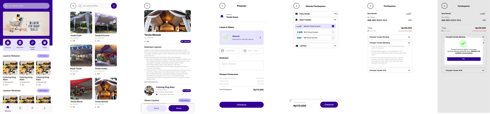

# MeriahIn--HackFest--2024

 This repository contains a collection of resources used during the project for HackFest 2024. This project focuses on creating an Mobile Apps for User Customer using kotlin. 

  

## Contributing

 Contributions to this project are welcome. If you have any ideas, suggestions, or improvements, please submit a pull request. Make sure to follow the existing coding style and guidelines. 

## License

This project is licensed under the [MIT License](https://opensource.org/licenses/MIT). Feel free to use, modify, and distribute the code as per the license terms.

## Contact

For any inquiries or feedback, please contact the project team.

This is Our Member MeriahIn

| Name                   | Role     | University          | LinkedIn                                                                                          |
| ---------------------- | -------- | ------------------- | ------------------------------------------------------------------------------------------------- |
| Lukman Mul Hakim       | Hustler  | Universitas Andalas |  |
| Hamzah Abdillah Arif   | Hipster  | Universitas Andalas |  |
| Fajar Alif Riyandi     | Hacker   | Universitas Andalas |  |
| Iqbal Defri Prasetya   | Hacker   | Universitas Andalas |  |

